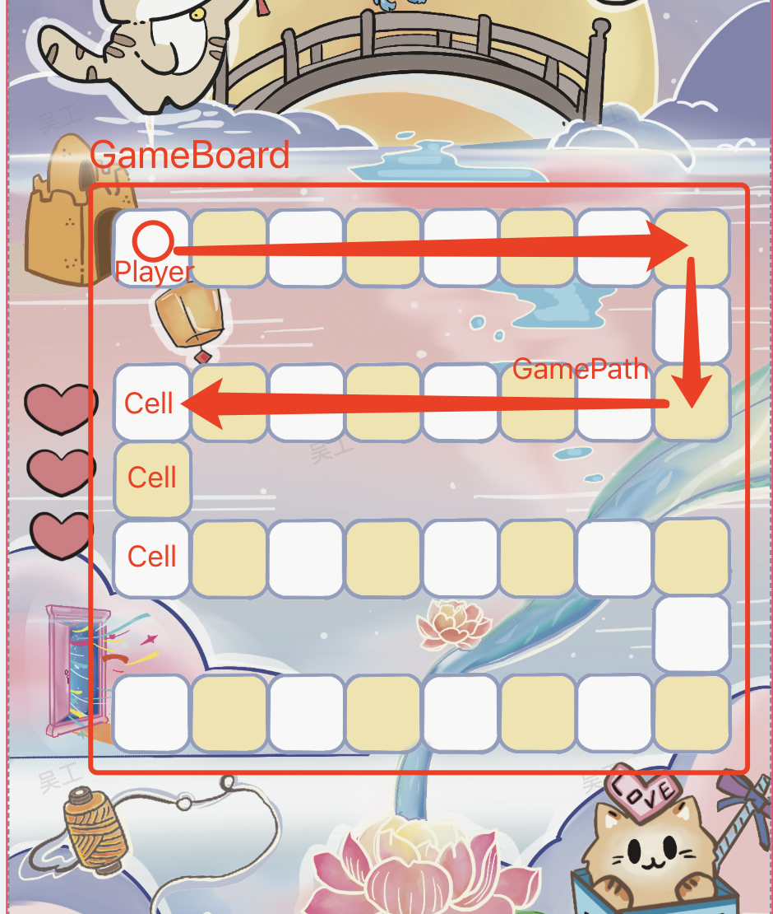
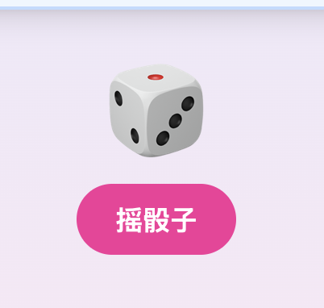
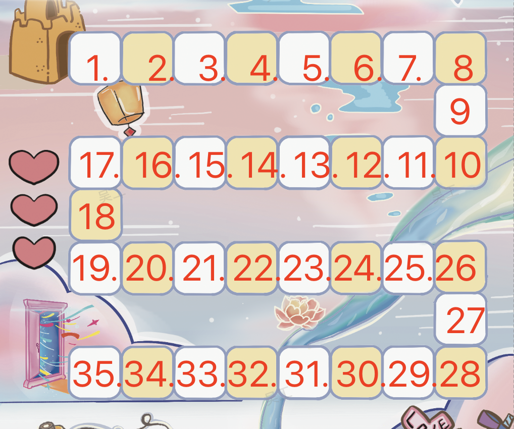

# 设计指南



## Step1 组件拆分

- [GameBoard](#gameboard): 游戏棋盘，即格子
- [GameCell](#gamecell): 每个格子，即单元格
- [GamePlayer](#gameplayer): 即游戏玩家
- [GameDice](#gamedice): 即骰子，如图 

## Step2 接口设计

### GameBoard

游戏棋盘，纯渲染组件。绘制一个支持 row(x) * col(y) 的栅格 Grid。

```tsx
<GameBoard row={8} col={7}>
  {/*... 绘制 x * y 个即可 */}
  {cells.map(cell => <GameCell />)}
</GameBoard>
```

### GameCell

游戏单元格，根据我们的业务，渲染不同的 UI。这里有个关键属性是 `order` 属性，它标识了我们移动的顺序。如下图所示：

- 

```tsx
/**
 * CellType
 *  - start 起点单元格
 *  - normal 普通单元格，啥都没有
 *  - special 特殊单元格，比如有特殊奖品，或者特殊逻辑
 *  - empty 空单元格
 *  - end 终点单元格
 */
export type CellType = 'start' | 'normal' | 'special' | 'end' | 'empty';

/**
 * 游戏单元格位置: (x, y) 坐标
 */
export interface Position {
  x: number;
  y: number;
}

/**
 * 逻辑单元格 数据结构
 */
export interface Cell {
  /**
   * 步骤顺序：
   *  - 0 即为不渲染的 empty 空单元格
   *  - integer 即为是有效步骤的单元格
   */
  order: number;
  /**
   * 单元格类型
   *  - start 起点单元格
   *  - normal 普通单元格，啥都没有
   *  - special 特殊单元格，比如有特殊奖品，或者特殊逻辑
   *  - empty 空单元格
   *  - end 终点单元格
   */
  type: CellType;
  /**
   * 奖品的数据结构
   */
  reward: string;
  /**
   * 即当前单元格的 x,y 行列坐标
   */
  position: Position;
}
```

它既有 UI，也有逻辑。UI 很简单，就是根据 `CellType` 渲染格子内容，逻辑就是需要暴露几个类似链表 `LinkedList` 的快捷方法。

```tsx
/**
 * 游戏单元格 基于链表 LinkedList 实现
 */
export interface GameCell extends LinkedList {
  /**
   * 获取上一个单元格
   */
  prev: () => Cell;
  /**
   * 获取下一个单元格
   */
  next: () => Cell;
}


<GameCell order={order} type={type} reward={reward} position={position} />
```

### GamePlayer

顾名思义，游戏玩家。在当前上下文就是 “喵喵 🐱” 咯。

- Player 需要通过摇骰子 rollDice 获取具体点数
- Player 需要沿着 `order` 从 `currentCell` 移动到 `targetCell`，即 `GamePath`
- Player 停在移动之后，需要判断停留的 `currentCell` 是否获奖，获奖则领奖

```tsx
/**
 * 游戏玩家
 */
export interface Player {
  /** 当前所在步骤单元格 */
  currentStep: Cell
  /** 摇骰子 */
  rollDice: () => 1|2|3|4|5|6;
  /**
   * 移动单元格:
   *  - 根据 step 从 currentCell 移动到 targetCell
   *  - step 为 [-6, 6] 的值，比如后退即为负数，前进即为整数
   *
   * 移动过程中：
   *  - 从 `GameCell.next()` 中取到 currentCell 到 targetCell 的 `GamePath` 路径
   *  - 在 `GamePath` 的每一个 `GameCell` 上逐个渲染移动动画，直到移动完毕
   */
  moveToCell: (step: number) => void
}
```

### GameDice

这个很简单，就是游戏中的骰子的实现了，基于状态机实现，有三种状态。

```tsx
/**
 * 骰子
 */
export interface GameDice {
  /**
   * 当前摇出来的值，默认是：0
   */
  value: 1|2|3|4|5|6;
  /**
   * 骰子的状态
   *  - idle: 空闲
   *  - rolling: 摇动中
   *  - stopped: 已停止
   */
  status: 'idle' | 'rolling' | 'stopped';
  /**
   * 摇骰子的异步方法
   *  - 执行完摇动动画后返回摇出的 1～6 随机数
   */
  roll: () => Promise<1|2|3|4|5|6>;
}

<GameDice />
```


## Step3 逻辑整理

1. 第一步：准备数据，通过 [Game.service](../services/Game.service.ts) 获取 `Cell` 单元格数据，组装 `cells` 数组

```tsx
const cells: Cell = GameService.getCellsList()
```

2. 第二步：渲染 UI，通过 `cells` 数据渲染 `GameBoard`，渲染 `GamePlayer` & `GameDice` 组件

3. 对三步：执行游戏逻辑：
  - Player 摇骰子 Dice 获取 Step
  - Player 移动图标到 targetStep = currentStep + nextStep

4. 循环往复，直到游戏结束